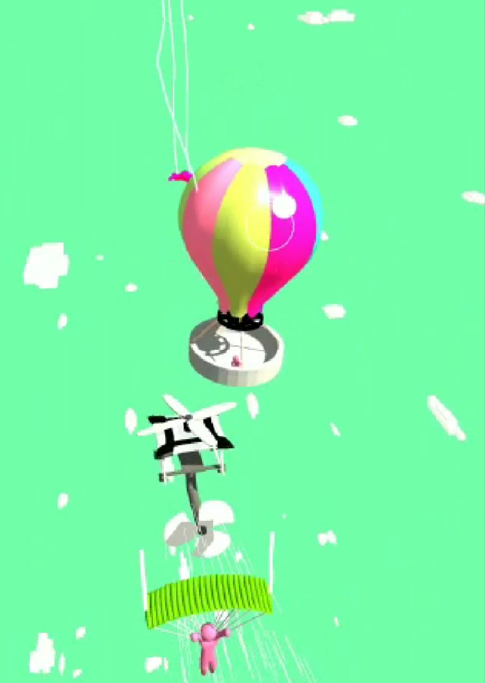
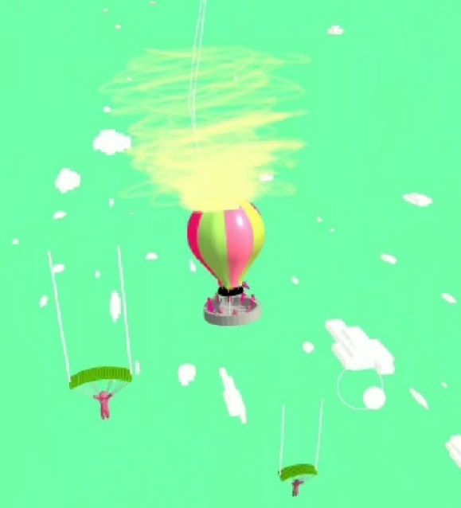

# RealisticBalloonMotion
Realistic tilt-based balloon motion without Rigidbody – Unity C# script

## 🇬🇧 English Description

### 📌 Project Purpose

This Unity C# script was developed during my summer internship in 2022. The goal is to simulate **realistic balloon-like movement without using Rigidbody**, which helps improve **performance and control** over lightweight objects.

By tracking an object's position and rotation changes, it estimates velocity and applies a soft tilt using that data. Perfect for balloons, leaves, cloth pieces, and other physics-inspired, wind-reactive objects.

---

### ⚙️ Technical Overview

- No Rigidbody required (optimized performance)
- Works inside `FixedUpdate` for consistent physics timing
- Uses a combination of Lerp + Clamp for rotation
- Calculates velocity based on object’s transform movement

---

### 🔧 Parameters

| Parameter         | Description |
|------------------|-------------|
| `minimumclamp`   | Minimum tilt angle allowed |
| `maximumclamp`   | Maximum tilt angle allowed |
| `smoother`       | Smoothing factor for rotation interpolation |
| `velocitydivisor`| Controls how much velocity affects the tilt amount |

---

### 🧪 How to Use

1. Add the script to your Unity project as `ObjVelocityReader.cs`.
2. Attach it to any GameObject (balloon, light prop, etc.).
3. Adjust the public parameters in the Unity Inspector.
4. Play the scene and observe how the object tilts naturally based on its movement.

---

### 🧠 Notes

- No Rigidbody dependency – ideal for performance-critical projects
- Mobile and VR/AR friendly
- Great for stylized or semi-physical animations

---

## 👤 About the Developer

This script was created in 2022 as part of a summer internship project, aiming to offer an optimized alternative to Unity's built-in physics system for lightweight objects.

---

## 📄 License

MIT License – Free to use and modify.

---

## Example Images

## 🇹🇷 Türkçe Açıklama

# 🎈 ObjVelocityReader - Rigidbody'siz Gerçekçi Balon Hareketleri (Unity C#)

### 📌 Proje Amacı

Bu proje, 2022 yılında gerçekleştirdiğim yaz stajım sırasında geliştirdiğim bir Unity script'idir. Amaç, **Rigidbody kullanmadan**, daha optimize ve kontrol edilebilir bir şekilde gerçekçi balon hareketleri oluşturmaktır.

Script, nesnenin pozisyon ve rotasyonundaki değişimleri kullanarak hız vektörünü hesaplar ve buna göre objeye yumuşak, fizik benzeri bir eğim efekti uygular. Özellikle balon, yaprak, kumaş parçaları gibi hafif ve rüzgârdan etkilenen nesneler için idealdir.

---

### ⚙️ Teknik Detaylar

- Rigidbody kullanılmaz (daha az performans yükü)
- Fizik frame’lerinde (`FixedUpdate`) çalışır
- Lerp + Clamp kombinasyonu ile dönüş hareketi uygulanır
- Kendi pozisyon takibi üzerinden velocity hesaplanır

---

### 🔧 Parametreler

| Parametre        | Açıklama |
|------------------|----------|
| `minimumclamp`   | Eğimin alabileceği minimum açı değeri (derece) |
| `maximumclamp`   | Eğimin alabileceği maksimum açı değeri (derece) |
| `smoother`       | Dönüş hareketinin ne kadar yumuşak uygulanacağını belirler |
| `velocitydivisor`| Hızdan elde edilen dönüş miktarını kontrol eder |

---

### 🧪 Kullanım

1. Script'i `ObjVelocityReader.cs` olarak projenize ekleyin.
2. Balon veya hafif bir nesne prefab'ına ekleyin.
3. Unity Inspector üzerinden parametreleri ihtiyacınıza göre ayarlayın.
4. Sahnenizi oynatın, balonun pozisyona göre eğilerek doğal bir hareket yaptığını gözlemleyin.

---

### 🧠 Notlar

- Rigidbody kullanılmadığı için manuel pozisyon güncellemeleri ile çalışır.
- Performans dostudur.
- VR ve mobil projeler için uygundur.

---

## 🧑‍💻 Geliştirici Hakkında

Bu script, 2022 yılında gerçekleştirdiğim bir yaz stajı sürecinde, performans odaklı fizik simülasyonlarına alternatif bir çözüm üretmek amacıyla geliştirilmiştir.

---

## Örnek Görseller

